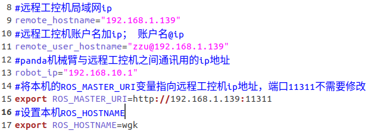
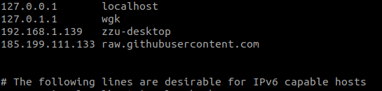
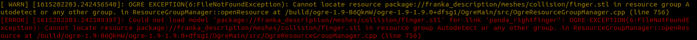
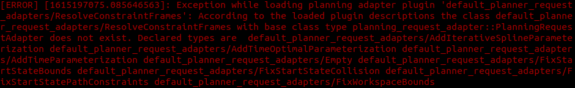
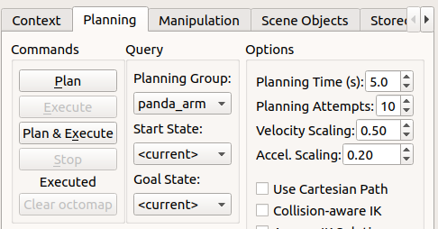

# Franka Emika Panda MoveIt! Config Package

The Panda robot is the flagship MoveIt! integration robot used in the MoveIt! tutorials.
Any changes to MoveIt! need to be propagated into this config fast, so this package
is co-located under the ``ros-planning`` Github organization here.

## 介绍

该包主要用于配合实体panda机械臂进行使用，安装在工作站端（需要对[工控机端进行配置](https://github.com/Hymwgk/panda_server)）,主要实现的功能主要是两部分：

- 设置本地ROS_MASTER_URL环境变量指向panda机械臂，并通过ssh与远程panda工控机进行通信，完成对远程实体机械臂的开锁、解锁等操作；

- 可启动rviz & Moveit，实现对远程机械臂的轨迹规划等操作。


## 安装

1. 确保完成了[工控机端的配置](https://github.com/Hymwgk/panda_server )；

2. 确保工作站可免密码ssh登录远程工控机；

3. 安装moveit

   ```
   sudo apt install ros-melodic-moveit
   ```

4. 安装panda的moveit配置包（我们的修改版本，包含了一些自定义launch文件）
   ```
   cd ~/catkin_ws/src
   git clone https://github.com/Hymwgk/panda_moveit_config.git -b melodic-devel
   cd ..
   catkin build
   echo 'source ~/catkin_ws/devel/setup.bash' >> ~/.bashrc
   ```
   
5.  安装panda的描述文件

    ```
    sudo apt-get install ros-melodic-franka-description
    ```

6. 安装要求的显示工具

   ```
   sudo apt-get install ros-melodic-moveit-visual-tools
   sudo apt-get install ros-melodic-moveit-ros-visualization
   ```

   或者直接

   ```
   sudo apt-get install ros-melodic-moveit-ros-*
   ```

7. 修改`panda_client.sh`，修改远程工控机局域网ip（例如下面的`192.168.1.139`）和账户名称(例如下图`zzu`)，修改机械臂FCI控制柜的ip（例如下图的`192.168.10.1`），修改ROS_HOSTNAME为本机hostname(使用`hostname`命令查询，如下图`wgk`)



8. **在工控机端**，执行`ifconfig`和`hostname`命令，得到工作站网络局域网地址(假设为`192.168.1.139)`和工控机hostname(假设为`zzu-desktop`)；返回**工作站端**执行命令

      ```
      sudo gedit /etc/hosts
      ```

      将工控机的局域网ip以及hostname填写到工作站hosts文件中（如下图第三行）



9. 执行`sudo /etc/init.d/networking restart`重启网络服务


## 使用（功能）

1. 使用工作站对同一局域网内的panda机械臂进行加锁解锁等操作

   - 将`panda_client.sh`拷贝到方便访问的位置（可选）
   
- 执行解锁/锁定操作
  
     ```bash
     source panda_client.sh -r
  source panda_client.sh -l
  ```

     

2. 使用rviz中的Moveit插件来控制实体panda机械臂

   - 查看...
   - 运行launch文件

       ```bash
        roslaunch panda_moveit_config zzu_panda_move.launch
       ```

       如果出现以下报错

       

       执行以下命令即可

       ```bash
       cd ~/catkin_ws/src/panda_moveit_config/config
       sudo cp -r collision   /opt/ros/melodic/share/franka_description/meshes
       ```
       
       如果出现以下错误，忽略即可，这个错误是由于binary版本Moveit的自带bug


   - 配置moveit的GUI，主要关心的是右侧的参数，防止机械臂运动过快

     